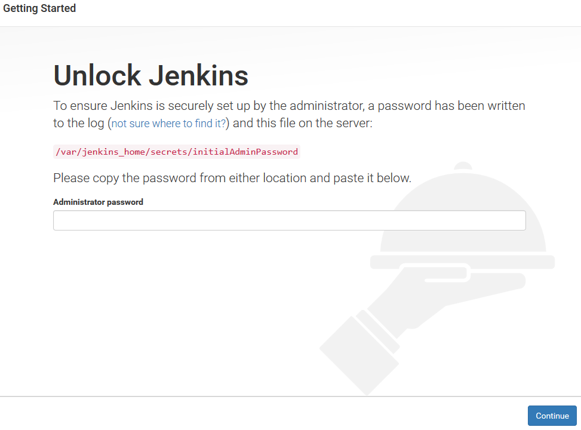
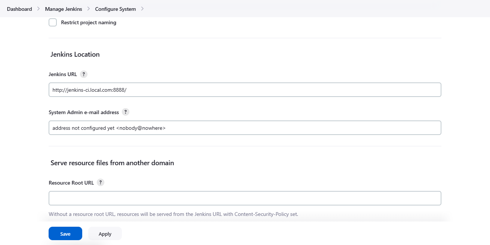
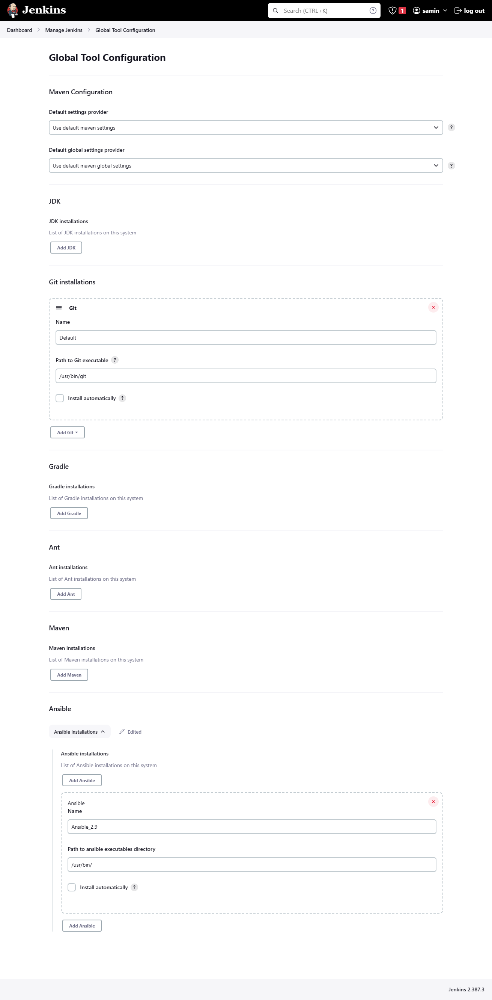
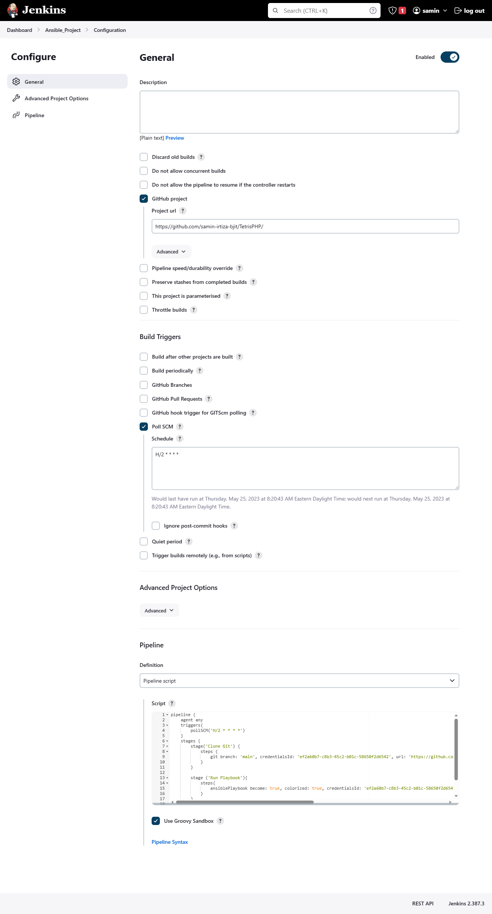
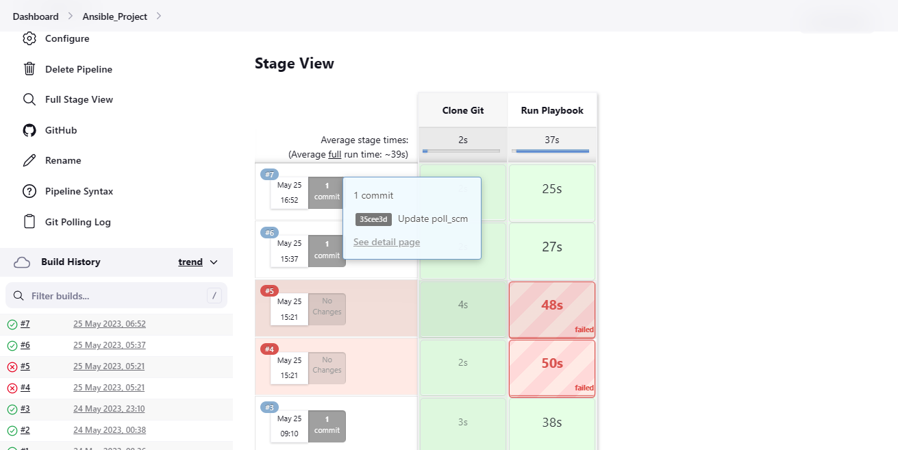
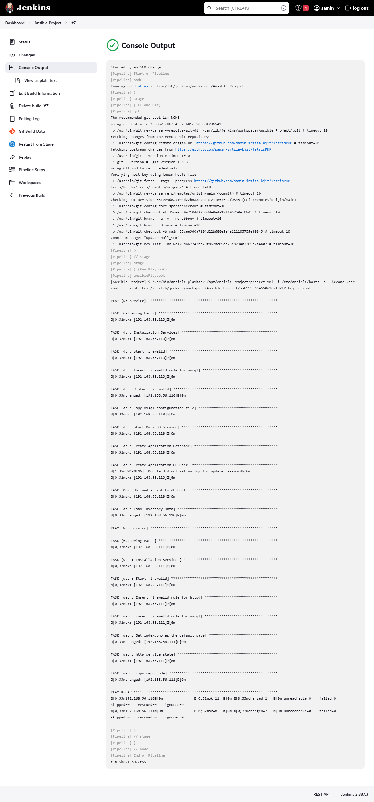
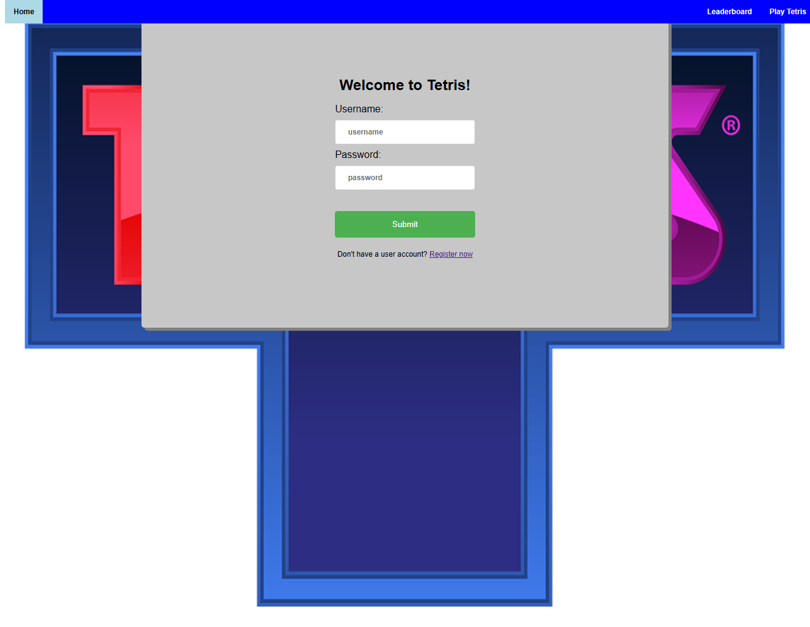
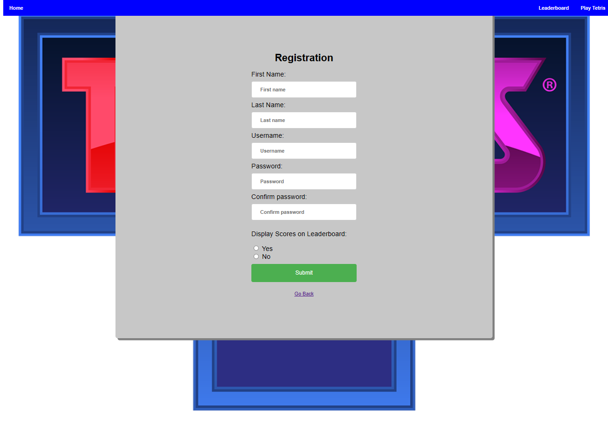
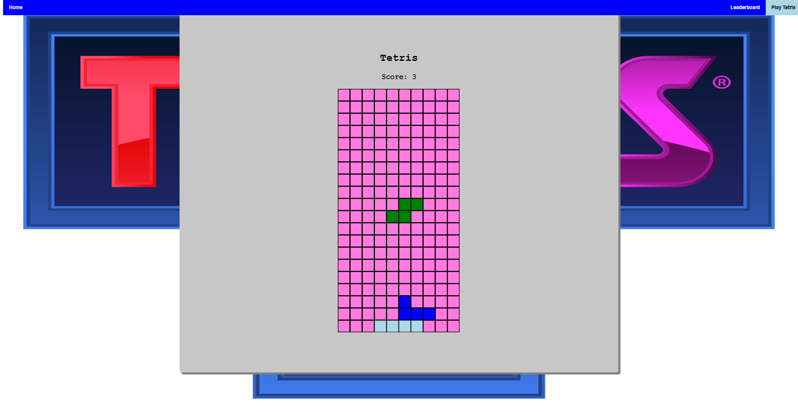
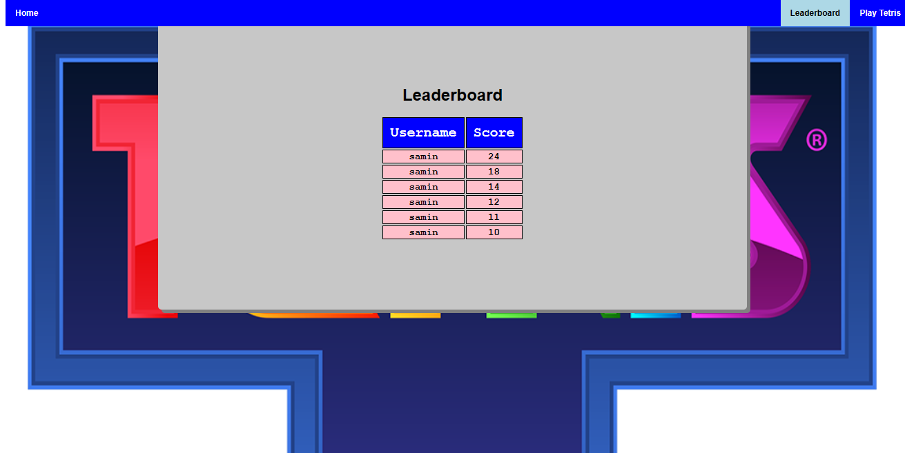

# Project-Tetris

## Github + Jenkins + Ansible + LAMP CI/CD Pipeline Documentation

----

## Tools Setup

### Github SSH Authentication
- Generate ssh key using the following command on host machine:

  `ssh-keygen -t rsa -C "github-access" -f id_rsa`

- Add the containing public key in `id_rsa.pub` file to your github account.


Install and setup 3 VMs with [CentOS 7 image](https://www.centos.org/download/) One will act as the master/controller node, one is for the Web Server (frontend & backend) and another is for Database. First step after installation is that we need to disable the selinux following the below instructions:

1. Open the selinux config file in the text editor of your choosing. I will use vi for this instance:

    `vi /etc/selinux/config`

2. Edit the line `SELINUX=enforcing` and set it to `SELINUX=disabled`.

3. Reboot the system

### Jenkins Installation

1. Need to update packages of all VM by the following command:
  
    `yum update -y`

2. Jenkins is a java program so firstly we need to install java on the master VM.

    `yum install java-11-openjdk.x86_64 -y`

3. To install the latest stable version of Jenkins , we have to add the official Jenkins
repository to the system. Execute the commands below to add the key and repo.

> 🔴IMPORTANT❗🔴 Note: If you want to hit your jenkins URL first you need to stop firewalld on centos or need to enable the port on firewalld. Otherwise you can not access jenkins dashboard on browser.

```
yum install wget -y
sudo wget -O /etc/yum.repos.d/jenkins.repo https://pkg.jenkins.io/redhat-stable/jenkins.repo
sudo rpm --import https://pkg.jenkins.io/redhat/jenkins.io-2023.key
```

### Jenkins Setup

After installation go to the browser of your host machine and input the following url in the address bar:

`{your_master_vm_ip}:8080`

You should be greeted with this:

<p align='center'>
</br></p>

Go to the mentioned location and use the password to unlock jenkins. pressing continue should take you to a new page that lets you create a new user. Create a user and login into Jenkins.

### Jenkins Custom Port & Domain
Go to **`Manage Jenkins --> Configure System`** and set a custom domain and port for making it easier to access jenkins.

> 🔴IMPORTANT❗🔴 If changing port settings of Jenkins configuration file doesn't change the port even after restarting, you need to modify jenkins service file inside /usr/lib/systemd/system/jenkins.service.

<p align='center'>
</br></p>

### Jenkins Global Tool Configuration
Go to **`Manage Jenkins > Global Tool Configuration`** and modify the settings according the the image below:

<p align='center'>
</br></p>

### Pipeline Setup

Create a new pipeline job from the jenkins dashboard. Go to **`Configuration`** menu of the project. Now set up the pipeline and additional configuration

<p align='center'>
</p>


### Pipeline Script

```
pipeline {
    agent any
    triggers{
        pollSCM('H/2 * * * *')
    }
    stages {
        stage('Clone Git') {
            steps {
                git branch: 'main', credentialsId: {your_credential_id}, url: 'https://github.com/samin-irtiza-bjit/TetrisPHP'
            }
        }
        
        stage ('Run Playbook'){
            steps{
                ansiblePlaybook become: true, colorized: true, credentialsId: {your_credential_id}, installation: 'Ansible_2.9', inventory: '/etc/ansible/hosts', playbook: '/opt/Ansible_Project/project.yml'
            }
        }
    }
}

```

<div style="page-break-after: always;"></div>

### Ansible Installation

Now we will install Ansible on the master VM.
1. Firstly we need to install the epel-release package so that we can install ansible from that
package. For this we need to run the below command:

    `sudo yum install epel-release`

2. Now we will install ansible by below command:
    
    `yum install ansible`

3. Login as the root user and create a user named ansible on both client VMs and run the following command to set visudo config to be able to access without a password prompt.

    `echo 'ansible ALL=(ALL) NOPASSWD:ALL' > /etc/sudoers.d/ansible`

4. Add the following configurations to the master/controller VM's ansible configuration file placed at **/etc/ansible/ansible.cfg**

```
[defaults]

# Remote user name
remote_user = ansible 

# SSH private key file
private_key_file = /root/.ssh/id_rsa

# Set the default module timeout to 60 seconds
timeout = 60

# Set the default number of forks to 10
forks = 10

# Enable fact gathering
gather_facts = smart 

# Set the default ansible_python_interpreter to /usr/bin/python3
ansible_python_interpreter = /usr/bin/python3

# Enable pipelining
pipelining = True

# Limit the maximum number of parallel connections per host to 5
max_parallel_connections = 5

# Limit the maximum number of seconds to wait for a connection to a managed node
timeout_connection = 10

```

5. We will add ansible clients which is our Web Server VM, Database Server VM ip address in
ansible configuration file.
    
    `sudo vim /etc/ansible/hosts`
```ini
  [db]
  192.168.56.110
  [web]
  192.168.56.111
```

6. We need to copy the ssh key of the master server in ansible client machines. So that the Ansible
server to its nodes communication will be passwordless.

```shell
ssh-copy-id root@192.168.56.111 [Web Server IP]
ssh-copy-id root@192.168.56.110 [Database Server IP]
```
<div style="page-break-after: always;"></div>

## Ansible Playbook Codes

### Ansible Roles Playbook Folder Structure

```
.
├── project.yml
└── roles
    ├── db
    │   ├── files
    │   │   ├── db-load-script.sql
    │   │   └── my.cnf
    │   ├── handlers
    │   │   └── main.yml
    │   ├── tasks
    │   │   └── main.yml
    │   ├── templates
    │   └── vars
    │       └── main.yml
    └── web
        ├── handlers
        │   └── main.yml
        ├── tasks
        │   └── main.yml
        ├── templates
        └── vars
            └── main.yml

```

### project.yml
```yaml
---
- name: DB Service
  hosts: db 
  become: yes
  roles:
    - db
- name: Web Service
  hosts: web
  become: yes
  roles:
    - web

```
<div style="page-break-after: always;"></div>

### roles/db/tasks/main.yml
```yaml
- name: Installation Services
  yum:
    name:
    - libselinux-python
    - libsemanage-python
    - mariadb-server
    - MySQL-python
    - php-mysql
    state: installed
  tags: install
- name: Start firewalld
  service: name=firewalld state=started enabled=yes
  tags: start firewalld
- name: Insert firewalld rule for mysql
  firewalld: port={{ mysql_port }}/tcp permanent=true state=enabled immediate=yes
  tags: enable mysql port
- name: Restart firewalld
  service: name=firewalld state=reloaded enabled=yes
  tags: restarted firewalld
- name: Copy Mysql configuration file
  copy: src=files/my.cnf dest=/etc/my.cnf
  tags: mysql conf copy
- name: Start MariaDB Service
  service: name=mariadb state=started enabled=yes
  tags: start mariadb
- name: Create Application Database
  mysql_db: name={{ dbname }} state=present
  tags: create database
- name: Create Application DB User
  mysql_user: name={{ dbuser }} password={{ dbpassword }} priv=*.*:ALL host='192.168.56.110' state=present
  tags: create user
- name: Move db-load-script to db host
  copy:
    src: files/db-load-script.sql
    dest: /tmp/db-load-script.sql
  tags: copy sql
- name: Load Inventory Data
  shell: mysql -f < /tmp/db-load-script.sql
  tags: run sql
```
<div style="page-break-after: always;"></div>

### roles/db/vars/main.yml
```yaml
---
mysql_port: 3306
dbname: tetris   
dbuser: tetris 
dbpassword: tetrispass 
```

### roles/db/files/db_load_scripts.sql
```sql
GRANT ALL PRIVILEGES ON *.* TO 'tetris'@'192.168.56.111' IDENTIFIED BY
'tetrispass' WITH GRANT OPTION;
FLUSH PRIVILEGES;

USE tetris;

CREATE TABLE Users (
  Username VARCHAR(50) PRIMARY KEY,
  FirstName VARCHAR(50) NOT NULL,
  LastName VARCHAR(50) NOT NULL,
  Password VARCHAR(50) NOT NULL,
  Display VARCHAR(50) NOT NULL
);
CREATE TABLE Scores (
  Username VARCHAR(50) NOT NULL,
  Score INT NOT NULL,
  PRIMARY KEY (Username, Score)
);
```

### roles/db/files/my.cnf

```ini
[mysqld]
bind-address=0.0.0.0
datadir=/var/lib/mysql
socket=/var/lib/mysql/mysql.sock
symbolic-links=0
[mysqld_safe]
log-error=/var/log/mariadb/mariadb.log
pid-file=/var/run/mariadb/mariadb.pid
!includedir /etc/my.cnf.d
```

<div style="page-break-after: always;"></div>

### roles/web/tasks/main.yml
```yaml
- name: Installation Services
  yum:
    name:
    - libselinux-python
    - libsemanage-python
    - httpd
    - git
    - php
    - php-mysql
    state: installed
  tags: install

- name: Start firewalld
  service: name=firewalld state=started enabled=yes
  tags: start firewalld

- name: Insert firewalld rule for httpd
  firewalld: port={{ httpd_port }}/tcp permanent=true state=enabled immediate=yes
  tags: enable httpd port

- name: insert firewalld rule for mysql
  firewalld: port={{ mysql_port }}/tcp permanent=true state=enabled immediate=yes
  tags: enable mysql port

- name: Set index.php as the default page
  replace:
    path: /etc/httpd/conf/httpd.conf
    regexp: 'DirectoryIndex index.html'
    replace: '#DirectoryIndex index.html \nDirectoryIndex index.php'
  tags: rename html file

- name: http service state
  service: name=httpd state=started enabled=yes
  tags: httpd start

- name: copy repo code
  git:
    repo: '{{ repository }}'
    dest: '/var/www/html/'
    force: yes
```

<div style="page-break-after: always;"></div>

### roles/web/vars/main.yml
```yaml
---
httpd_port: 80
mysql_port: 3306
repository: https://github.com/samin-irtiza-bjit/TetrisPHP.git
```


## Working Pipeline

If everything is set up correctly, jenkins should start an auto build and deploy the website upon pushing a commit into the GitHub repository:

### Auto Polling from GitHub

<p align='center'>
</p></br>

<div style="page-break-after: always;"></div>

### Playbook output from the pipeline

<p align='center'>
</p></br>

### Deployed Website

<p align='center'>
</p></br>
<p align='center'>
</p></br>
<p align='center'>
</p></br>
<p align='center'>
</p></br>

